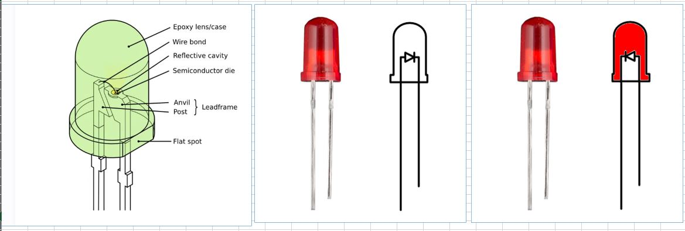

# 5mm-LED-polarity  
arduino project to read diode and forward voltage  

# LED +/- , 相反的實例, 見過還是有不明白的地方.  

### lead length but not indicator for polarity, the why  
做WAFER時已經存在的問題? 還是單純打線錯誤 ?  
打線只有一根, 襯底是另外一個電極, PN 怎麼就對掉了呢?  
迷.  
2024-04-05  
讀書, LED 晶粒分成 PN型,  NP 型,  
N型基板，在其表面沉積一層P型半導體, 且叫做 PN型,  
P型基板，在其表面沉積一層N型半導體, 且叫做 NP型, 比較不常見,  
導線架兩隻腳, 一長一短並且是公模,   
習慣短腳做成光杯, 黏住LED 晶粒,  
打線只有一根, 因此打錯線的問題並不存在, 只是便宜行事, 單一種導線架配套兩種極性的LED晶粒,  
所以依靠長腳短腳來區分正負極變成不可靠  

  